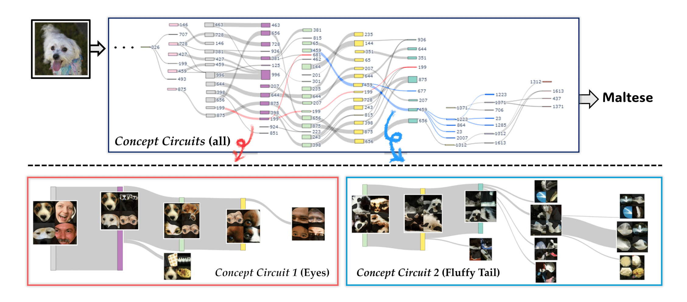

# Granular Concept Circuit (GCC)

Dahee Kwon* · Sehyun Lee* · Jaesik Choi

This is the official implementation of **Granular Concept Circuits: Toward a Fine-Grained Circuit Discovery for Concept Representations**, published in ICCV 2025.

## Abstract
Deep vision models have achieved remarkable classification performance by leveraging a hierarchical architecture in which human-interpretable concepts emerge through the composition of individual neurons across layers. Given the distributed nature of representations, pinpointing where specific concepts are encoded within a model remains a crucial yet challenging task in computer vision. **In this paper, we introduce an effective circuit discovery method, called Granular Concept Circuit (GCC), in which each circuit represents a concept relevant to a given query**. To construct each circuit, our method iteratively assesses inter-neuron connectivity, focusing on both functional dependencies and semantic alignment. By automatically discovering multiple circuits, each capturing specific concepts within that query, our approach offers a profound, concept-wise interpretation of models and is the first to identify circuits tied to specific visual concepts at a fine-grained level.


## Setup
1) To create the conda environment needed to run the code, run the following command:

```
conda env create -f environment.yaml
conda activate GCC
```


2) (Optional) If you use older GPU drivers (i.e., CUDA 11.8), please try this version of PyTorch.
 
```
pip install torch==2.1.0 torchvision==0.16.0 torchaudio==2.1.0 --index-url https://download.pytorch.org/whl/cu118
```  

Now, you are ready to explore deep vision models with GCC. 

## Usage
 1) **Identify root nodes**: We designate a node as a root node if its activation for a query sample falls within the top 1% across all samples. To identify such cases, we extract the top 1% highest activation samples for each node.
- Make sure to download the corresponding dataset. Here, we use the [ImageNet validation dataset](https://image-net.org/download.php).  
- Modify the output directory path according to your setup.  

```
python3 get_highly_activated_samples.py --model_name 'resnet50' --dataset 'imagenet' --n_samples 500 --out_dir '/GCC/results/'
```

 2) **Extract Granular Concept Circuits**: Run the following script to extract circuits for a given query.

```
bash scripts/selected_resnet50.sh
```

 3) **Visualization** (will be provided soon)
